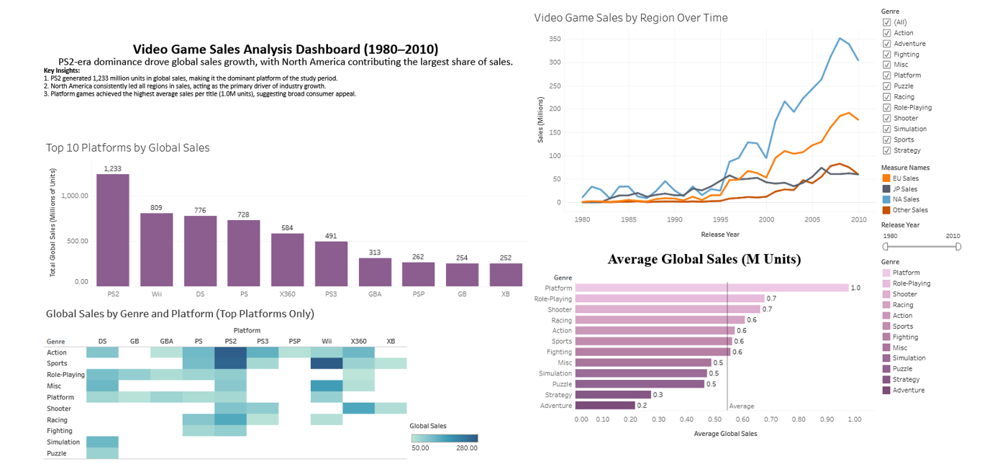

# 🎮 Global Video Game Sales Analysis (Tableau)

This project is an interactive dashboard created in Tableau to analyse global video game sales data between **1980 and 2010**. The dashboard presents business insights through interactive visualisations, allowing users to explore sales trends, regional performance, platform popularity, publisher performance, and genre popularity.

The project involved preparing and analysing historical sales data, creating interactive visualisations, and identifying trends to support business decision-making.

## 🎯 Project Aim

The main goals of this project were to:

- Prepare the video game sales data for analysis.
- Analyse historical sales performance using Tableau.
- Build an interactive dashboard with filters and dashboard actions.
- Identify trends in sales across years, regions, platforms, publishers, and genres.
- Present the results in a clear and easy-to-understand format.

## 📊 Live Dashboard

🔗 **[View the Interactive Tableau Dashboard](https://public.tableau.com/app/profile/wioletta.zajac/viz/GlobalVideoGameSalesAnalysisTableauDashboard/VideoGameSalesAnalysisDashboard19802010)**

## 📂 Dataset

The dataset contains historical video game sales between **1980 and 2010**. Each record includes information about the game title, platform, publisher, genre, release year, regional sales, and global sales.

The data was prepared before being analysed in Tableau to create the interactive dashboard.

The main columns include:

| Column | Description |
|---------|-------------|
| `Name` | Video game title |
| `Platform` | Gaming platform |
| `Year` | Release year |
| `Genre` | Game genre |
| `Publisher` | Game publisher |
| `NA_Sales` | North America sales (millions) |
| `EU_Sales` | Europe sales (millions) |
| `JP_Sales` | Japan sales (millions) |
| `Other_Sales` | Other region sales (millions) |
| `Global_Sales` | Total global sales (millions) |

**Dataset Source:** Kaggle – Video Game Sales Dataset

## 🧹 Data Preparation

Before creating the dashboard, the data was prepared by:

- Checking for missing values.
- Reviewing data types.
- Formatting the release year.
- Validating regional and global sales values.
- Removing unnecessary fields.

## 📊 Features

- Global sales analysis
- Regional sales comparison
- Platform performance analysis
- Publisher performance analysis
- Genre popularity analysis
- Interactive dashboard with filters and dashboard actions

## 🛠️ Tools Used

- Tableau Public
- Dashboard Actions
- Filters
- Calculated Fields
- Data Visualisation

## 📁 Files

- [Tableau Dashboard](https://public.tableau.com/app/profile/wioletta.zajac/viz/GlobalVideoGameSalesAnalysisTableauDashboard/VideoGameSalesAnalysisDashboard19802010) – Interactive Tableau dashboard

## 📷 Dashboard Preview

The dashboard allows users to interact with the data using filters to explore video game sales by year, region, platform, publisher, and genre.

## ❓ Business Questions Answered

This dashboard helps answer questions such as:

- Which years recorded the highest video game sales?
- Which platforms were the most successful?
- Which publishers generated the highest sales?
- Which genres were the most popular?
- How did sales differ across regions?

## 📈 Key Insights

- Nintendo was the leading publisher during the period analysed.
- North America generated the highest overall video game sales.
- Action and Sports were the best-selling genres.
- Sales patterns varied across different regions.
- Platform popularity changed significantly over time.

## ⚠️ Challenges Faced

During this project, I faced a few challenges that helped me improve my Tableau and data visualisation skills.

- Learning how to build interactive dashboards using Tableau.
- Creating filters and dashboard actions that updated multiple visualisations.
- Choosing the most effective charts to present different aspects of the data.
- Turning historical sales data into meaningful business insights.

By overcoming these challenges, I improved my Tableau skills, gained confidence in building interactive dashboards, and learned how to communicate insights more effectively through data visualisation.

## 🎯 Skills Demonstrated

- Data preparation
- Tableau
- Interactive dashboard design
- Dashboard actions
- Filters
- Calculated fields
- Data visualisation
- Exploratory data analysis (EDA)
- Business intelligence
- Turning raw data into clear business insights

## 🚀 About This Project

This project is part of my data analytics portfolio. It helped me improve my Tableau skills, particularly in dashboard design, data visualisation, and business analysis.

During this project, I learned how to transform historical sales data into interactive dashboards and present business insights in a clear and engaging way. I look forward to continuing to build projects using Tableau and other data analytics tools.

## 👤 Author

**Wioletta Zajac**

[View my Tableau Public Portfolio](https://public.tableau.com/app/profile/wioletta.zajac)
